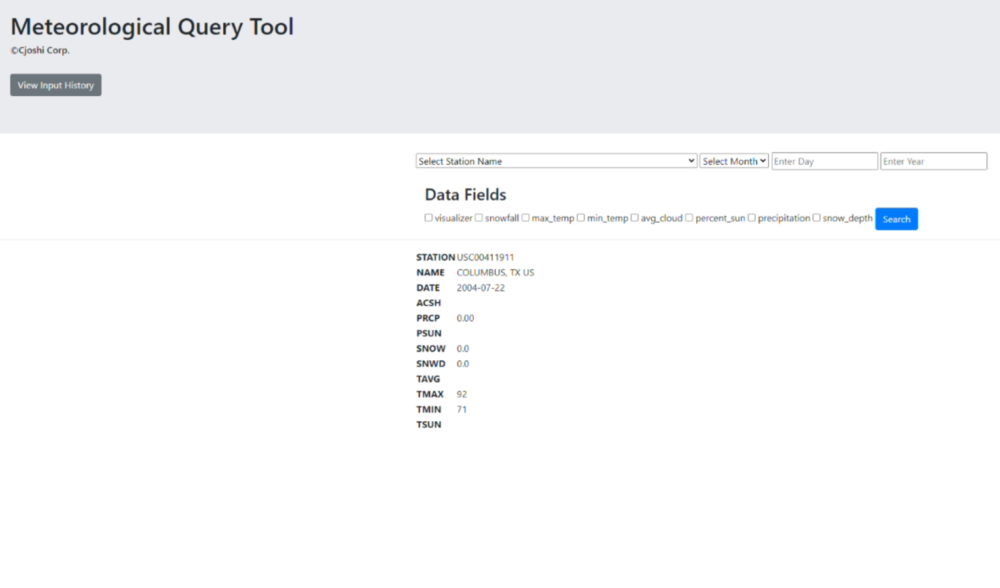

[![Contributors][contributors-shield]][contributors-url]
[![Issues][issues-shield]][issues-url]
[![LinkedIn][linkedin-shield]][linkedin-url]

<!-- PROJECT LOGO -->
<br />
    
<p align="center">
  <a href="https://github.com/cjoshi7/meteorological-query-tool">
    
  </a>

  <h1 align="center">Meteorological Query Tool</h1>

  <p align="center">
    Visualize the spread of the coronavirus on a day-by-day basis.
    <br />
    <a href="https://github.com/cjoshi7/covid19-date-selector"><strong>Explore the docs »</strong></a>
    <br />
    <br />
    <a href="https://youtu.be/r9-8qcNwKmk">View Demo</a>
    ·
    <a href="https://github.com/cjoshi7/meteorological-query-tool">Report Bug</a>
    ·
    <a href="https://github.com/cjoshi7/meteorological-query-tool">Request Feature</a>
  </p>
</p>

<!-- TABLE OF CONTENTS -->
<details open="open">
  <summary>Table of Contents</summary>
  <ol>
    <li>
      <a href="#about-the-project">About The Project</a>
      <ul>
        <li><a href="#built-with">Built With</a></li>
      </ul>
    </li>
    <li>
      <a href="#getting-started">Getting Started</a>
      <ul>
        <li><a href="#prerequisites">Prerequisites</a></li>
        <li><a href="#installation">Installation</a></li>
      </ul>
    </li>
    <li><a href="#usage">Usage</a></li>
    <li><a href="#roadmap">Roadmap</a></li>
    <li><a href="#contributing">Contributing</a></li>
    <li><a href="#contact">Contact</a></li>
    <li><a href="#acknowledgements">Acknowledgements</a></li>
  </ol>
</details>


<!-- ABOUT THE PROJECT -->
## About The Project

<p align="center">
  <a href="https://github.com/cjoshi7/meteorological-query-tool">
    
  </a>
</p>

The purpose of the MQT is to provide a statistical representation of climate data
from 30 years ago to today from numerous meteorological stations across the United States. This is 
done though the use of the National Climate Data Center's database and a web application to provide 
a seamless user interface. All queries are conducted in log(n) time complexity due to the use of SQL
indexes. The user can query data from a specific date or create a visualization of climate trends
using the Matplotlib library.

### Inspiration
I noticed that it was difficult to find an API to query meteorological data for a specific region on a specific day, so I created a minimalist web API that allows the user to query climate data from 30 years ago to today from numerous meteorological stations across the United States. The targeted audiences are researchers who would like to obtain very specific data that is difficult to find in other places.

### What it does
The tool queries the National Climate Data Center's meteorological database and returns the data specified by the user in the form of a table.

### How I built it
This application is built using Flask with Python, jQuery with JavaScript to asyncronously update the website, and the Bootstrap framework to rapidly develop the CSS. The NCDC's meteorological database was used and installed in the form of a csv. The back-end stack is needed to make SQL queries to the included database.

### Challenges I ran into
This project was also developed for learning purposes as I was dipping my toes into web development, so it was challenging to build a cohesive product while simutaneously learninig what languages and technologies I needed to make it happen. However, in the end I learned about the various web framworks for Python and JavaScript, development stacks, and how to develop a web application.


### Built With
* [Flask](https://plotly.com/dash)
* [SQLite3](https://getbootstrap.com)
* [Bootstrap](https://bootstrap.com)
* [jQuery](https://jquery.com)

## Getting Started

No API key is needed to access the tool, so the application may be locally run through the python file.

### Prerequisites

The Flask framework and SQLite3 RDBMS must be installed as a prerequisite.
* pip
  ```sh
  pip install requirements.txt
  ```

### Installation

#### Compile Source

1. Clone the repo
   ```sh
   git clone https://github.com/chinarjoshi/meteorological-query-tool
   ```
2. Install prerequisites
   ```sh
   pip install requirements.txt
   ```
4. Initialize a flask development server
   ```sh
   flask run
   ```

#### Docker
1. __TODO__


<!-- USAGE EXAMPLES -->
## Usage

This tool can be used for research purposes to find the meteorological data from a specified date and region.

1. Select the station from the dropdown menu
2. Input the date into the corresponding fields
3. Select which datatypes to query from the database

_For more examples, please refer to the [Documentation](https://github.com/cjoshi7/meteorological-query-tool)_


<!-- ROADMAP -->
## Roadmap

__See the [open issues](https://github.com/cjoshi7/covid19-date-selector) for a list of proposed features (and known issues).__

### Features
The following features will be implemented in the future.
1. Add additional visualizations of the data using Matplotlib
    -- Temperature vs Time graph
    -- Bar graph of selected datatypes

2. Dark theme

### Source
* Manipulate the DOM using jQuery and AJAX calls. When the submit button is pressed, make a GET request to the server using the input fields.
    * PROBLEM: When the HTML form is submitted, the corresponding JS event listener doesnot reccognize the event, likely due to syntax error because of confusion between element vs id JS syntax. Figure out how to properly select DOM elements.
* Allow a range of dates to be selected on the HTML file and render coordinate plot using the database response. Use this instead of table.
* Change the padding and color of the Bootstrap classes in styles.css to center the input fields and change background color.

<!-- CONTRIBUTING -->
## Contributing

Any contributions to extend features are **greatly appreciated**.

1. Fork the Project
2. Create your Feature Branch (`git checkout -b feature/newFeature`)
3. Commit your Changes (`git commit -m 'Add NewFeature'`)
4. Push to the Branch (`git push origin feature/newFeature`)
5. Open a Pull Request

<!-- CONTACT -->
## Contact

Chinar Joshi - chinarjoshi7@gmail.com

Project Link: [https://github.com/cjoshi7/covid19-date-selector](https://github.com/cjoshi7/covid19-date-selector)

<!-- ACKNOWLEDGEMENTS -->
## Acknowledgements
* [Virus Icon](https://dndi.org/diseases/covid-19/target-product-profile/)
* [Readme Template](https://github.com/othneildrew/Best-README-Template)
* [Img Shields](https://shields.io)
* [GitHub Pages](https://pages.github.com)
* [Animate.css](https://daneden.github.io/animate.css)
* [Loaders.css](https://connoratherton.com/loaders)

<!-- MARKDOWN LINKS & IMAGES -->
<!-- https://www.markdownguide.org/basic-syntax/#reference-style-links -->
[contributors-shield]: https://img.shields.io/github/contributors/chinarjoshi/meteorological-query-tool?style=for-the-badge
[contributors-url]: https://github.com/chinarjoshi/meteorological-query-tool/graphs/contributors
[forks-shield]: https://img.shields.io/github/forks/chinarjoshi/meteorological-query-tool?style=for-the-badge
[forks-url]: https://github.com/chinarjoshi/meteorological-query-tool/network/members
[stars-shield]: https://img.shields.io/github/stars/chinarjoshi/meteorological-query-tool?style=for-the-badge
[stars-url]: https://github.com/chinarjoshi/meteorological-query-tool/stargazers
[issues-shield]: https://img.shields.io/github/issues/chinarjoshi/meteorological-query-tool?style=for-the-badge
[issues-url]: https://github.com/chinarjoshi/meteorological-query-tool/issues
[license-shield]: https://img.shields.io/github/license/chinarjoshi/meteorological-query-tool?style=for-the-badge
[license-url]: https://github.com/chinarjoshi/meteorological-query-tool/blob/master/LICENSE.txt
[linkedin-shield]: https://img.shields.io/badge/-LinkedIn-black.svg?style=for-the-badge&logo=linkedin&colorB=555
[linkedin-url]: https://linkedin.com/in/chinarjoshi
[product-screenshot]: images/screenshot.png
